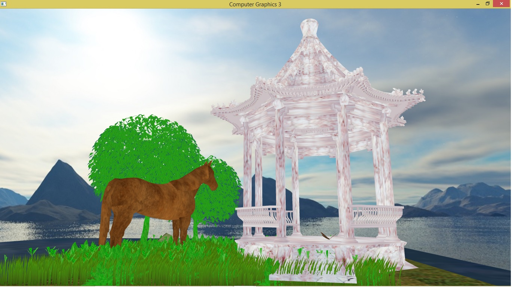

3D Graphics with OpenGL

Windows 8 x64
Visual Studio 2015 v140 + SOIL library

-Executable file -  /bin/main.exe
programm will be opened in ~20 sec

To move the camera click 'w'(forward)/'s(back)', 
to turn it up/down/left/right use cursor/buttons

-Grass blades are made from triengles, using Instanced rendering
number of grass blades - 10000
each of them has different size and switch.

-Grass is effected by Wind, which has its speed, acceleration and is done by Hooke's law

-anti-aliasing(MSAA) - to turn on/off push 'A' (is turned by default)
-sky cube maps 
-A horse, trees, a building and butterfly are drawn using 3D models in .obj format 

Nguyen Khanh Huyen 

